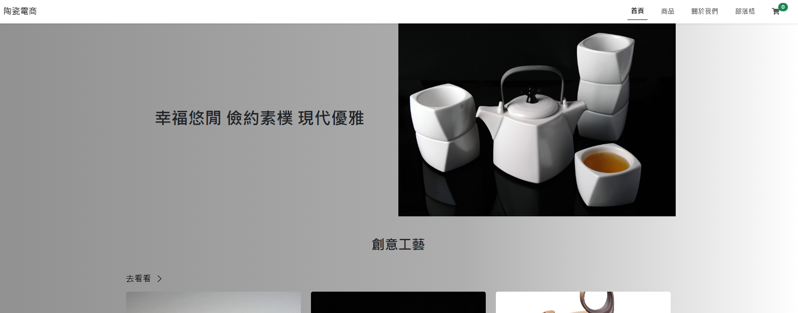
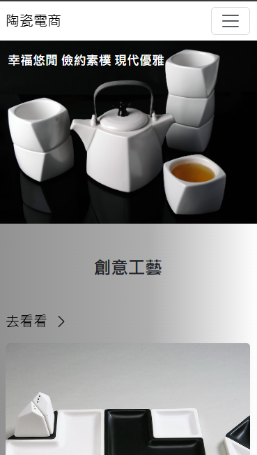

# Final Project - 陶瓷電商平台 Ceramica

靈感來自家裡長輩做陶瓷的創業夢，我把這個想法做成了一個超完整的電商網站！
網站分為前台與後台，前台可以逛商品、加購物車、看陶瓷文章、線上結帳；後台則能上架商品、發文、管理訂單，全都搞定！  
設計走清爽風、加了動畫與 Toast 提醒，讓體驗不只好看也好用，還支援 RWD 自適應顯示，手機也能逛！


[陶瓷電商網站](https://xiaojia0623.github.io/reactweek-classproject8/)
--- 

### 首頁畫面



--- 

## 功能介紹

### 前台 Front

- 商品瀏覽與分類篩選
- 商品詳細介紹
- 購物車管理（數量調整、刪除、優惠券）
- 結帳流程（填寫表單、付款、成功頁面）
- 部落格文章介紹
- 關於我們頁面
- 響應式設計支援桌機 / 平板 / 手機等裝置

### 後台 Admin

- 商品管理（新增 / 編輯 / 刪除）
- 訂單管理（查看 / 刪除）
- 優惠券管理
- 文章管理
- 管理者登入驗證

---

## 專案目錄結構

<pre> ```text
src/
│
├── assets/ # 圖片、動畫與樣式素材
│ └── styles/
│
├── components/ # 常用元件如 Header、Footer、Toast 等
│ └── common/ # 模組化元件包含管理 Modal
│
├── layout/ # 前台與後台 Layout
│
├── pages/ # 各頁面（依前台 front、後台 admin 分類）
│ ├── admin/
│ └── front/
│
├── redux/ # Redux slices（購物車、訂單、優惠券、Toast）
│
├── router/ # React Router 設定
│
├── App.jsx # 主應用組件
├── main.jsx # 入口檔案
└── index.html # HTML 模板
 ``` </pre>

 ---

## 使用技術與工具一覽

| 分類          | 技術/套件名稱                                         | 用途說明                                |
| ------------- | ----------------------------------------------------- | --------------------------------------- |
| 前端框架      | `React 18`, `Vite`                                    | 建立現代化單頁應用、快速開發與編譯      |
| 路由管理      | `react-router-dom`                                    | 前後台路由切換與動態路由處理            |
| 狀態管理      | `@reduxjs/toolkit`, `react-redux`                     | 管理購物車、訂單、優惠券、Toast 狀態    |
| 請求處理      | `axios`                                               | 與後端 API 溝通、資料 CRUD              |
| 響應式設計    | `Bootstrap`, `Media Query`                            | 打造支援各種裝置大小的自適應版面（RWD） |
| UI 組件與框架 | `bootstrap`, `react-bootstrap`                        | 快速建立響應式設計、彈性 UI 元件        |
| 表單與驗證    | `react-hook-form`, `react-input-mask`                 | 使用者表單輸入、驗證與遮罩              |
| 動畫效果      | `animate.css`, `aos`, `framer-motion`, `lottie-react` | 提升頁面動態效果與互動感                |
| 圖示          | `@fortawesome/react-fontawesome`                      | 美化 UI 的圖標                          |
| 輪播模組      | `swiper`                                              | 首頁或推薦區商品輪播展示                |
| 日期處理      | `dayjs`, `date-fns`                                   | 處理日期格式與運算                      |
| 提示通知      | `sweetalert2`, `sweetalert2-react-content`            | 彈出提示、操作成功或錯誤通知            |
| 其他工具      | `uuid`                                                | 產生唯一識別碼（如訂單 ID）             |
| 專案部署      | `gh-pages`                                            | 快速將專案部署至 GitHub Pages           |
| 程式碼品質    | `eslint`, `eslint-plugin-react`, `vite-plugin-eslint` | 維護程式碼風格與一致性                  |
| 樣式處理      | `sass`, `sass-embedded`, `sass-migrator`              | 支援 SASS 樣式撰寫與遷移                |

---

## 快速開始

```bash
# 安裝依賴
npm install

# 開發模式啟動
npm run dev

# 建立正式版
npm run build

# 部署至 GitHub Pages
npm run deploy
```

---

## React + Vite

This template provides a minimal setup to get React working in Vite with HMR and some ESLint rules.

Currently, two official plugins are available:

- [@vitejs/plugin-react](https://github.com/vitejs/vite-plugin-react/blob/main/packages/plugin-react/README.md) uses [Babel](https://babeljs.io/) for Fast Refresh
- [@vitejs/plugin-react-swc](https://github.com/vitejs/vite-plugin-react-swc) uses [SWC](https://swc.rs/) for Fast Refresh

## Expanding the ESLint configuration

If you are developing a production application, we recommend using TypeScript and enable type-aware lint rules. Check out the [TS template](https://github.com/vitejs/vite/tree/main/packages/create-vite/template-react-ts) to integrate TypeScript and [`typescript-eslint`](https://typescript-eslint.io) in your project.


